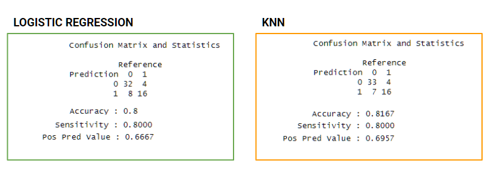

# 1. HEART FAILURE PREDICTION

```{r}
library(knitr)

```

`Img Source` : <https://images.wsj.net/im-127798/?width=700&size=1.5>

`link`: <https://www.kaggle.com/datasets/andrewmvd/heart-failure-clinical-data>

**Cardiovascular diseases** (CVDs) stand as the leading global cause of death, claiming approximately 17.9 million lives each year, constituting 31% of total global fatalities. Heart failure, a common consequence of CVDs, is a major concern addressed by this dataset, featuring 12 key variables for predicting mortality linked to heart failure.

The prevention of most cardiovascular diseases hinges on managing behavioral risk factors like tobacco use, unhealthy dietary habits, obesity, physical inactivity, and excessive alcohol consumption through widespread public health strategies. Individuals with existing cardiovascular diseases or those at a heightened risk due to factors such as hypertension, diabetes, hyperlipidemia, or pre-existing conditions necessitate early detection and effective management, for which machine learning models offer significant assistance.

## 1.1 Notes on Specific Variables

-   `age` = Age
-   `anaemia` = Decrease of red blood cells or hemoglobin (boolean)
-   `creatinine_phosphokinase` = Level of the CPK enzyme in the blood (mcg/L)
-   `diabetes` = If the patient has diabetes (boolean)
-   `ejection_fraction` = Percentage of blood leaving the heart at each contraction (percentage)
-   `high_blood_pressure` = If the patient has hypertension (boolean)
-   `platelets` = Platelets in the blood (kilo-platelets/mL)
-   `serum_creatinine` = Level of serum creatinine in the blood (mg/dL)
-   `serum_sodium` = Level of serum sodium in the blood (mEq/L)
-   `sex` = Woman or man (binary)
-   `smoking` = If the patient smokes or not (boolean)
-   `time` = Follow-up period (days)
-   `DEATH_EVENT` = If the patient deceased during the follow-up period (boolean)

## 1.2 Objective

Dependent variable = `DEATH_EVENT`

# 2. DATA PREPERATION

The First step is inserting the csv file into R located in data_input and then installing the necessary plugins including `dplyr`, `lubridate`, `caret`, etc.

```{r}
#Read data csv
heart <- read.csv("heart_failure_clinical_records_dataset.csv")

library(dplyr)               # Used for data manipulation
library(lubridate)           # Used for date and time manipulation (used by 'glimpse' function)
library(caret)               # Used for data splitting and machine learning (used for 'prop.table' and 'upSample')
library(ggplot2)             # Used for data visualization
library(MASS)                # Used for logistic regression (logistic model fitting)
library(class)               # Used for k-nearest neighbor (KNN) classification
```

Next, we will observe our data set which we exported from the *csv*.

```{r}
head(heart)
```

We will also observe the `glimpse()` to check all the columns.

```{r}
glimpse(heart)
```

❓ Variabel target: DEATH_EVENT `0 = Alive` `1   = Deceased`

Next, we will mutate multiple columns from int `->` factor List of columns needs to be changed : `anaemia`, `diabetes`, `high_blood_pressure`, `sex`, `smoking`, `DEATH_EVENT`

```{r}
#Mutating columns using command "mutate_at" to convert multiple columns at once
heart <- heart %>%
  mutate_at(vars("anaemia", "diabetes", "high_blood_pressure", "sex", "smoking", "DEATH_EVENT"), as.factor)
```

Afterward, we will need to check if there are any rows with missing value or NA datas

```{r}
#Checking NA Data
length(complete.cases(heart))
```

# 3. DATA EXPLORATION

```{r}
summary(heart$age)
```

The age distribution of patients in the dataset reveals a median age of 60 years, with the majority falling between 51 and 70 years. The age range spans from a minimum of 40 years to a maximum of 95 years, demonstrating the diversity of ages among the patients.

```{r}
ggplot(heart, aes(x=age)) +
  geom_histogram(binwidth = 1, fill = "red", color = "white") +
  labs(title = "Age Distribution", subtitle= "of patients", x = "Age", y = NULL) + 
  theme_minimal()
```

```{r}
ggplot(heart, aes(x = DEATH_EVENT, y = age, group = DEATH_EVENT)) +
  geom_boxplot(fill = "red", color = "black") +
  labs(title = "Age correlation", subtitle = "with Heart Failure", x = "Death From Heart Failure", y = NULL) + 
  theme_minimal()
```

From the plot above, it could be concluded that the older the patients are, the higher their chances are from dying from heart failure.

```{r}
ggplot(heart, aes(x = DEATH_EVENT, y = serum_creatinine, group = DEATH_EVENT)) +
  geom_boxplot(fill = "red", color = "black") +
  labs(title = "Heart Failure correlation", subtitle = "with Serum Creatinine", x = "Death From Heart Failure", y = NULL) + 
  theme_minimal()
```

From the plot above, it could be concluded that the higher the level of serum creatinine in patients blood, the higher their chances of death from heart failure.

# 4. PREDICTION

Prediction will be made two times by two different models, **Logistic Regression** and **K-Nearest Neighbor**. This two-fold prediction strategy allows for a comprehensive evaluation of the data set, considering different modeling techniques and their respective strengths, ultimately contributing to a well-rounded understanding of the data and its predictive potential.

## 4.1 Logistic Regression

**Logistic Regression** is a statistical modeling technique used to analyze the relationship between a binary outcome and one or more predictor variables. It's commonly employed for classification tasks, such as predicting whether an event will occur (1) or not (0).

*First step* is to divide the original data set into two, test and training.

```{r}
RNGkind(sample.kind = "Rounding")
set.seed(417)

# index sampling
index <- sample(x = nrow(heart), size = nrow(heart)*0.8) 

# splitting
heart_train <- heart[index,] 
heart_test <- heart[-index,] 
```

```{r}
prop.table(table(heart_train$DEATH_EVENT))
```

Since we have an imbalanced proportion of our target variable, we will need to Up sample the data

```{r}
#upsampling
RNGkind(sample.kind = "Rounding")
set.seed(100)

heart_train_up <- upSample(x = heart_train[, -which(names(heart_train) == "DEATH_EVENT")], 
                          y = heart_train$DEATH_EVENT, # Target column
                          yname = "DEATH_EVENT")
```

Now we have a balanced proportion of target variable available to be trained.

```{r}
prop.table(table(heart_train_up$DEATH_EVENT))
```

```{r}
table(heart_train_up$DEATH_EVENT)
```

*Next* we will find which columns affect our target variable the most by using all predictors on creating the first model.

### 4.1.1 Modelling

The first model created will used all the predictors available on the data set.

```{r}
model1 <- glm(formula = DEATH_EVENT~., data = heart_train_up, family = "binomial")
summary(model1)
```

From the summary above, it is concluded that the most significant predictors are `age`,`ejection_fraction`,`serum_creatinine`, `serum_sodium`, `sex`, and `time`.

### 4.1.2 Model Fitting

```{r}
model2 <- stepAIC(model1, direction = "backward")
```

The initial model has an AIC of **297.89**.

-   In the first step, the predictor `smoking` is removed, resulting in a new model with an AIC of 295.93.

-   The process continues with the removal of predictors `diabetes`, `anaemia`, `high_blood_pressure`, and `platelets`.

-   The final selected model has an AIC of 292.29 and includes the following predictors: `age`, `creatinine_phosphokinase`, `ejection_fraction`, `platelets`, `serum_creatinine`, `serum_sodium`, `sex`, and `time`.

This stepwise variable selection process helps identify the most relevant predictors for predicting DEATH_EVENT while simplifying the model by removing less important variables. The selected model with an AIC of **297.89** represents the best trade-off between model complexity and predictive accuracy for the given data.

### 4.1.3 Predicting

```{r}
pred_heart <-predict(model2,  newdata = heart_test, type = "response")
```

```{r}
head(as.data.frame(pred_heart))
```

```{r}
# Determining the threshold
pred_heart_t <- as.factor(if_else(pred_heart > 0.5, "1", "0"))
```

```{r}
pred_heart_con <- confusionMatrix(data = pred_heart_t, reference = heart_test$DEATH_EVENT, positive = "1")
pred_heart_con
```

**Insight** : The model will prioritize `false negatives` (FN), where the prediction is 0 and the reference is 1, as these instances involve incorrectly classifying a potentially dangerous condition as healthy, which could have severe consequences.

-   `Accuracy` = The model's accuracy is 0.8, indicating the proportion of correct predictions.
-   `Sensitivity` = With a sensitivity of 0.8000, the model excels at identifying positive cases.
-   `Pos Pred Value` = The positive predictive value is 0.6667, signifying the precision of predictions for heart failure.

## 4.2 K-Nearest Neighbor

**K-Nearest Neighbor** (KNN) is a simple yet effective machine learning algorithm used for classification and regression tasks. It relies on the principle of proximity, where it assigns a data point's classification or value based on the majority of its nearest neighbors in the feature space.

### 4.2.1 Modelling

```{r}
# predictors
heart_train_x <- heart_train_up %>% select_if(is.numeric)
heart_test_x <- heart_test %>% select_if(is.numeric)
```

```{r}
# target
heart_train_y <- heart_train_up[,"DEATH_EVENT"]
heart_test_y <- heart_test[,"DEATH_EVENT"]
```

```{r}
# scaling
heart_train_xs <- scale (heart_train_x)
heart_test_xs <- scale(heart_test_x, center = attr(heart_train_xs, "scaled:center"), # mengambil info mean
                                   scale = attr(heart_train_xs, "scaled:scale")) # mengambil info stdev
```

```{r}
#Finding the K for predicitng
sqrt(nrow(heart_train)) 
```

### 4.2.2 Predicting

Since, there are only 2 unique targets, we will use the nearest odd numbers from `sqrt()` which is **15**

```{r}
# predicting using knn
heart_pred <- knn(train = heart_train_xs, # scaled data train
                 test = heart_test_xs, #
                 cl = heart_train_y, # label
                 k = 15)
```

```{r}
# confusion matrix
confusionMatrix(data = heart_pred, #Prediction
                reference = heart_test$DEATH_EVENT, # Data from test
                positive = "1")
```

**Insight** : The model will prioritize `false negatives` (FN), where the prediction is 0 and the reference is 1, as these instances involve incorrectly classifying a potentially dangerous condition as healthy, which could have severe consequences.

-   `Accuracy` = The model's accuracy is 0.8167, representing the proportion of correct predictions.
-   `Sensitivity` = With a sensitivity of 0.8000, the model effectively identifies positive cases.
-   `Pos Pred Value` = The positive predictive value is 0.6957, indicating the likelihood of actual positive cases among predicted positives.

# 5. SUMMARY

```{r}

```

In the heart failure prediction task, both the **Logistic Regression** and **K-Nearest Neighbor (KNN)** models exhibited remarkably similar results, boasting an identical sensitivity rate of **80%**. However, the differentiating factor emerged in terms of overall accuracy, where **KNN prevailed** with an accuracy rate of **81%**. This indicates that while both models excel at correctly identifying individuals at risk of heart failure, KNN's slightly higher accuracy underscores its robust predictive capabilities, making it a particularly valuable choice in the medical context where precision is paramount.
